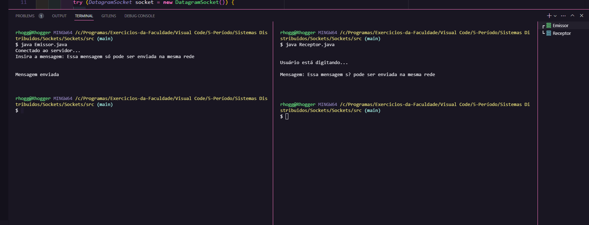

<h1 align="center">Sockets UDP</h1>

[Projeto](#projeto) &nbsp;&nbsp;&nbsp;|&nbsp;&nbsp;&nbsp; [Tecnologias](#tecnologias)
&nbsp;&nbsp;&nbsp;|&nbsp;&nbsp;&nbsp; [Licença](#license)

  

 

 
 

## 💻 Projeto 

Esse projeto foi desenvolvido durante a disciplina de Sistemas Distribuídos juntamente com meu
parceiro de projetos em dupla ou grupo, Rhuan Pablo.

O intuito desse código é enviar e receber mensagem por meio de Sockets.

Para testar, basta ir no arquivo `Emissor.java` e mudar o IP ou deixar no localhost (127.0.0.1)
mesmo. Após isso, execute primeiro o `Receptor.java` e depois o `Emissor.java`.

 
 

## 🚀 Tecnologias 

- Java
- Sockets UDP

 
 

## 🔒 Licença

Esse projeto está sob a licença MIT.

